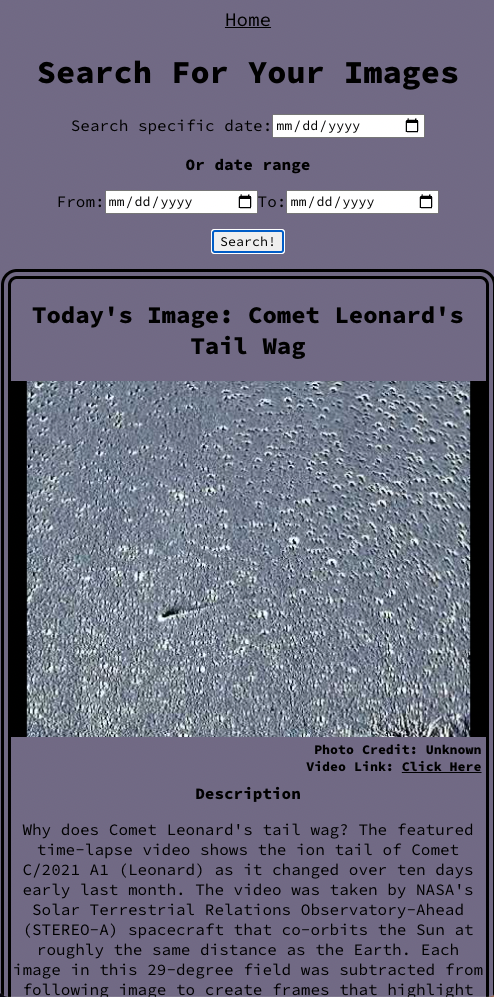
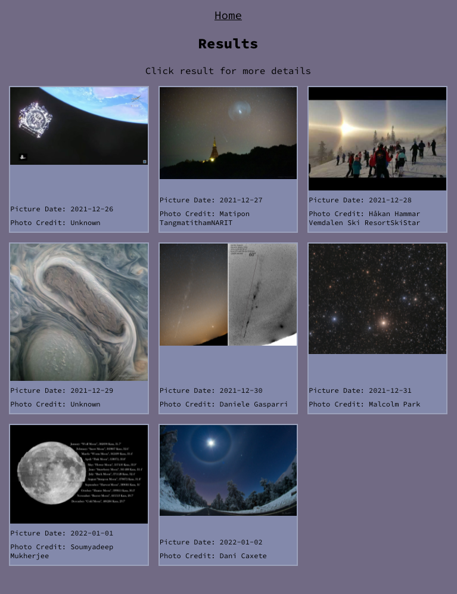
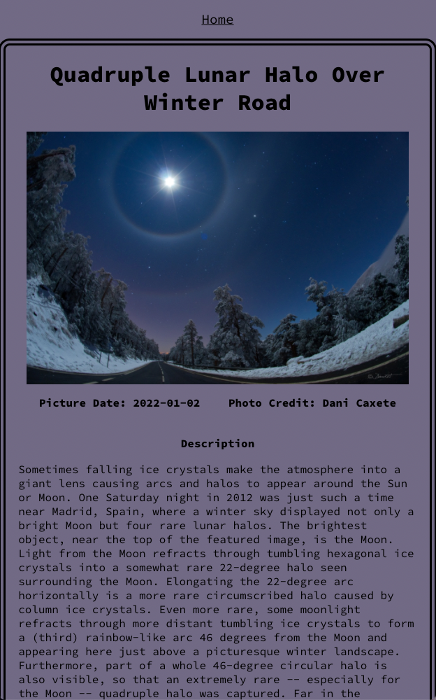

# Astronomy Picture Search

## Description

NASA has been uploading a daily astronomy image or video since 1995. My app displays today's content and allows you to search for a particular image or a range of images by date. Once searched, you can view a high quality image along with more image details and a description giving the significance of the image.

### App Screenshots

## Technologies Used:
- HTML
- CSS
- JavaScript
- React 
- Visual Studio Code
- GitHub
- Netlify
- Google Chrome

## Installation Instructions
Fork and clone this repo, inputting the below command into your terminal.

`$ git clone (SSH/HTTPS KEY HERE)`

After cloning repo, cd into newly created repo and install react dependencies.

`$cd astronomy-react-app`

`$npm install`

After dependencies are installed, open code in your code editor then start a local server with the following terminal commands.

`$code .`

`$npm start`

React components and styling code are located in the src folder. 

## Contribution Guidelines

### Improvement Propositions

You can propose improvements through a pull request. Be sure to leave thorough comments describing added code and outside sources. 

### Bug fix requests

You can request bug fixes through issues. Be sure to thoroughly describe steps taken to reproduce bug. Also include expected outcome vs actual outcome. Include any error messages.
